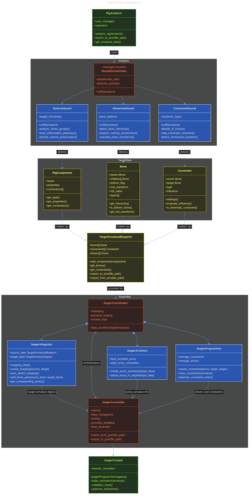

### JEAGER M.O. Structure Plan
### _slow down, this is just a blueprint!_

```mermaid
---
config:
  theme: dark
  hideEmptyMembersBox: 'true'
  themeVariables:
    background: 'green'
    primaryColor: '#333'
    primaryBorderColor: black
    primaryTextColor: #ff
    lineColor: '#65a2ff'
    secondaryBorderColor: 'red'
    secondaryTextColor: '#08ffec'
    noteBorderColor: aqua
    noteBkgColor: '#181818'
  look: classic
  layout: dagre
title: JEAGER M.O. blueprint V1.1
---
classDiagram
    direction TB
   
        class RigAnalyzer:::green {
            +user_managed
            +operators
            +analyze_rig(armature)
            +export_to_json(file_path)
            +get_armature_data()
        }


    namespace Analysis {
        class HoundOrchestrator:::orange {
            <<manages hounds>>
            +sniff(armature)
            -classification_data
            -detection_priorities

        }
        class HierarchyHound:::blue {
            +sniff(armature)
            -bone_patterns
            -detect_bone_hierarchy()
            -analyze_naming_conventions()
            -calculate_bone_transforms()
        }
        class ConstraintHound:::blue {
            +sniff(armature) 
            -constraint_types
            -identify_ik_chains()
            -map_constraint_networks()
            -detect_mechanical_systems()
        }
        class DeformHound:::blue {
            +sniff(armature) 
            -weight_thresholds
            -analyze_vertex_groups()
            -trace_deformation_pathways()
            -identify_volume_preservation()
        }
    }

    namespace TargetData {
        class RigComponent:::yellow {
            +name
            +properties
            +connections[]
            +get_type()
            +get_properties()
            +get_connections()
        }
        class Bone:::yellow {
            +parent Bone
            +children[] Bone
            +deform_flag
            +rest_transform
            +roll_value
            +layers[]
            +get_hierarchy()
            +is_deform_bone()
            +get_full_transform()
        }
        class Constraint:::yellow {
            +owner Bone
            +target Bone
            +type
            +influence
            +settings()
            +evaluate_influence()
            +is_kinematic_constraint()
        }
    }

    class TargetArmatureBlueprint:::yellow {
        +bones[] Bone
        +constraints[] Constraint
        +drivers[] Driver
        +add_component(component)
        +get_bones()
        +get_constraints()
        +export_to_json(file_path)
        +import_from_json(file_path)
    }

    namespace Assembly {
        class JeagerIntegrator:::blue {
            +source_data TargetArmatureBlueprint
            +target_data TargetArmatureDigest
            +mapping_data()
            +create_mapping(source, target)
            +auto_detect_mapping()
            +add_bone_pair(source_bone, target_bone)
            +get_corresponding_bones()
        }

        class JeagerArchitect:::blue {
            +create_proxy_armature(target_data)
            +load_template_proxy
            +adjust_proxy_to_target(target_data)
            +align_proxy_orientation
        }
        class JeagerProgrammer:::blue {
            +create_constraints(proxy, target, jeager)
            +clear_constraints(armature)
            +manage_constraints
            +manage_drivers
            +optimize_constraint_chain()
        }
        class JeagerCoordinator:::orange {
            +initialising
            +prevents_looping
            +creates_logs
            +data_provider(TargetArmature)
        }
        class JeagerAssembler:::orange {
            +checks
            +data_managment
            +testing
            +provides_feedback
            +final_assembly
            +import_from_json(file_path)
            +export_to_json(file_path)
        }

    }
    class JeagerCockpit:::green {
        +transfer_animation
        JeagerProgrammer(mapping)
        +bake_animation(armature)
        +validates_input()
        +optimize_keyframes()
    }

    RigAnalyzer --> HoundOrchestrator : [ uses ]

    HoundOrchestrator --> HierarchyHound
    HoundOrchestrator --> ConstraintHound
    HoundOrchestrator --> DeformHound

	HierarchyHound ..> Bone : [ detects ]
	ConstraintHound ..> Constraint : [ detects ]
	DeformHound ..> RigComponent : [ detects ]

    RigComponent --|> TargetArmatureBlueprint : [ makes up ]
    Bone --|> TargetArmatureBlueprint : [ makes up ]
    Constraint --|> TargetArmatureBlueprint : [ makes up ]

    JeagerIntegrator --> JeagerAssembler : [ target armature digest ]
    TargetArmatureBlueprint --> JeagerCoordinator : [ provides for ]
    JeagerCoordinator <--> JeagerAssembler : [ orchestratess ]
    JeagerCoordinator *--> JeagerProgrammer
    JeagerCoordinator *--> JeagerArchitect
    JeagerCoordinator *--> JeagerIntegrator

   
	JeagerArchitect --> JeagerAssembler : [ proxy armature fit ]
	JeagerProgrammer --> JeagerAssembler : [ drivers and constraints ]

    JeagerAssembler --> JeagerCockpit
    
    classDef yellow color:#ffff70,stroke:#ffd800,fill:#332
    classDef orange color:#ff8050,stroke:#ff5200,fill:#322
    classDef green color:#a7ff30,stroke:limegreen,fill:#232
    classDef blue stroke:white,fill:#2b56b0
```
 

