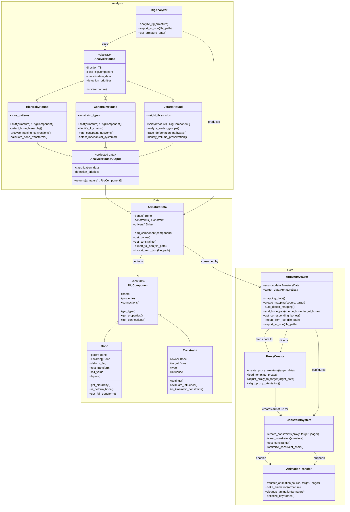

### UJAPI Project Structure Plan
### _slow down, this is a blueprint!_

```mermaid
classDiagram
    namespace Analysis {
        class RigAnalyzer {
            +analyze_rig(armature)
            +export_to_json(file_path)
            +get_armature_data()
        }
        
        class AnalysisHound {
            direction TB
            <<abstract>>
            class RigComponent
                +sniff(armature) 
                -classification_data
                -detection_priorities
            
        }
        
        class HierarchyHound {
            +sniff(armature) RigComponent[]
            -bone_patterns
            -detect_bone_hierarchy()
            -analyze_naming_conventions()
            -calculate_bone_transforms()
        }
        
        class ConstraintHound {
            +sniff(armature) RigComponent[]
            -constraint_types
            -identify_ik_chains()
            -map_constraint_networks()
            -detect_mechanical_systems()
        }
        
        class DeformHound {
            +sniff(armature) RigComponent[]
            -weight_thresholds
            -analyze_vertex_groups()
            -trace_deformation_pathways()
            -identify_volume_preservation()
        }

        class AnalysisHoundOutput {
            <<collected data>>
            +returns(armature) RigComponent[]
            -classification_data
            -detection_priorities
        }
    }
    
    RigAnalyzer --> AnalysisHound : uses
    AnalysisHound <|--|> HierarchyHound 
    AnalysisHound <|--|> ConstraintHound
    AnalysisHound <|--|> DeformHound
    HierarchyHound  --|> AnalysisHoundOutput
    ConstraintHound --|> AnalysisHoundOutput
    DeformHound --|> AnalysisHoundOutput
    AnalysisHoundOutput --|> ArmatureData

    namespace Data {
        class ArmatureData {
            +bones[] Bone
            +constraints[] Constraint
            +drivers[] Driver
            +add_component(component)
            +get_bones()
            +get_constraints()
            +export_to_json(file_path)
            +import_from_json(file_path)
        }
        
        class RigComponent {
            <<abstract>>
            +name
            +properties
            +connections[]
            +get_type()
            +get_properties()
            +get_connections()
        }
        
        class Bone {
            +parent Bone
            +children[] Bone
            +deform_flag
            +rest_transform
            +roll_value
            +layers[]
            +get_hierarchy()
            +is_deform_bone()
            +get_full_transform()
        }
        
        class Constraint {
            +owner Bone
            +target Bone
            +type
            +influence
            +settings()
            +evaluate_influence()
            +is_kinematic_constraint()
        }
    
    }
    RigComponent <|-- Bone
    RigComponent <|-- Constraint
    ArmatureData --> RigComponent : contains

    
    namespace Core {
        class ArmatureJeager {
            +source_data ArmatureData
            +target_data ArmatureData
            +mapping_data()
            +create_mapping(source, target)
            +auto_detect_mapping()
            +add_bone_pair(source_bone, target_bone)
            +get_corresponding_bones()
            +import_from_json(file_path)
            +export_to_json(file_path)
        }
        
        class ProxyCreator {
            +create_proxy_armature(target_data)
            +load_template_proxy()
            +adjust_proxy_to_target(target_data)
            +align_proxy_orientation()
        }
        
        class ConstraintSystem {
            +create_constraints(proxy, target, jeager)
            +clear_constraints(armature)
            +test_constraints()
            +optimize_constraint_chain()
        }
        
        class AnimationTransfer {
            +transfer_animation(source, target, jeager)
            +bake_animation(armature)
            +cleanup_animation(armature)
            +optimize_keyframes()
        }
        

    }
    ArmatureJeager --> ProxyCreator : feeds data to
    ProxyCreator --> ConstraintSystem : creates armature for
    ConstraintSystem --> AnimationTransfer : enables
    RigAnalyzer --> ArmatureData : produces
    ArmatureData --> ArmatureJeager : consumed by
    ArmatureJeager --> ProxyCreator : directs
    ArmatureJeager --> ConstraintSystem : configures
    ConstraintSystem --> AnimationTransfer : supports
    classDef pink color:pink
```
 

