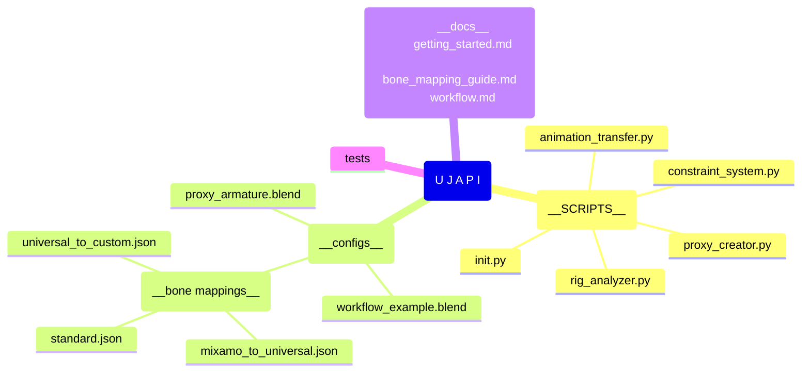

UJAPI Project Structure Plan
_slow down, this is a blueprint!_

 

## Key Components

**Scripts** - _Core Python scripts that implement the main functionality:_
- rig_analyzer.py/: Analyzes a rig and dumps its structure to JSON
- proxy_creator.py/: Creates the universal proxy armature
- constraint_system.py/: Sets up the bone constraints
- animation_transfer.py/: Transfers animations between rigs
.
**Configs**  -  _Configuration files for bone mappings and export settings:_
- bone_mappings/: Contains JSON files defining bone mappings
- export_presets/: Contains export settings for various formats

**Examples**  -  _Example files demonstrating the workflow:_
- proxy_armature.blend/: A pre-built proxy armature
- workflow_example.blend/: A complete example workflow

**Docs**  -  _Documentation files:_
- getting_started.md: Guide to get started with UJAPI
- bone_mapping_guide.md: Guide for creating bone mappings
- workflow.md: Detailed workflow documentation

Tests  -  _Test files and scripts:_
- test_bone_transfer.blend: Test file for the bone transfer system
